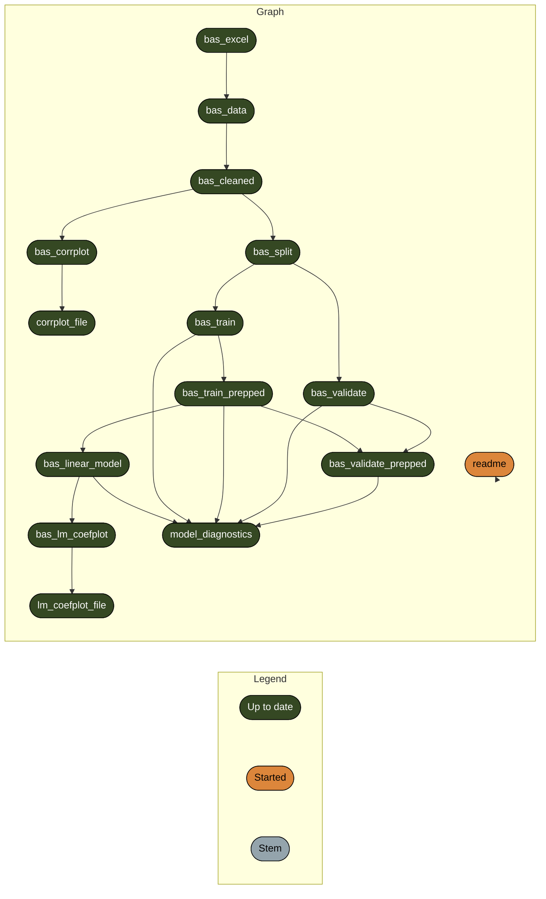

<!-- README.md is generated from README.Rmd. Please edit that file -->

# Monkeypox Clinical Diagnosis Analysis

[-MIT-blue.svg)](https://opensource.org/licenses/MIT)
[-CC0_1.0-lightgrey.svg)](http://creativecommons.org/publicdomain/zero/1.0/)

This repository contains data and R code which are supplements to

*Enhanced surveillance of monkeypox in Bas-Uélé, Democratic Republic of
Congo: the limitations of symptom-based case definitions*, by Gaspard
Mande, Innocent Akonda, Anja De Weggheleire, Isabel Brosius, Laurens
Liesenborghs, Emmanuel Bottieau, Noam Ross, Guy -Crispin Gembue, Robert
Colebunders, Erik Verheyen Ngonda Daulya, Herwig Leirsh, and Anne
Laudisoit (2022)

Please cite that paper, and/or the Zenodo data reference
(<https://dx.doi.org/10.5281/zenodo.6574451>) when using or refering to
this study.

## Repository Structure and Reproducibility

-   `data/` contains de-identified data from the study and a data
    dictionary
-   `R/` contains functions used in this analysis.
-   `reports/` contains literate code foor R Markdown reports generated
    in the analysis
-   `outputs/` contains compiled reports and figures.
-   This project uses the
    [{targets}](https://wlandau.github.io/targets-manual/) framework to
    organize build steps for analysis pipeline. The steps are defined in
    the `_targets.R` file and the workflow can be executed by running
    `run.R` via `source("run.R")` in your R terminal or `Rscript run.R`
    in your system shell.

-   This project requires R 4.2.0. This project uses the
    [{renv}](https://rstudio.github.io/renv/) framework to record R
    package dependencies and versions. Packages used are recorded in
    `renv.lock` and code used to manage dependencies is in `renv/` and
    other files in the root project directory. On starting an R session
    in the working directory, run `renv::restore()` to install R package
    dependencies.
    -   The package also requires
        [`cmdstan`](https://mc-stan.org/users/interfaces/cmdstan) to be
        installed. (Version 2.29.2 was used). If not already installed,
        run `cmdstanr::install_cmdstan(version = "2.29.2")` after
        `renv::restore()`
